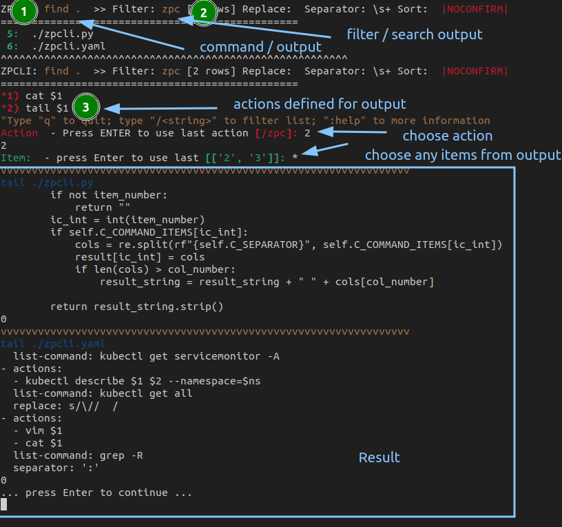
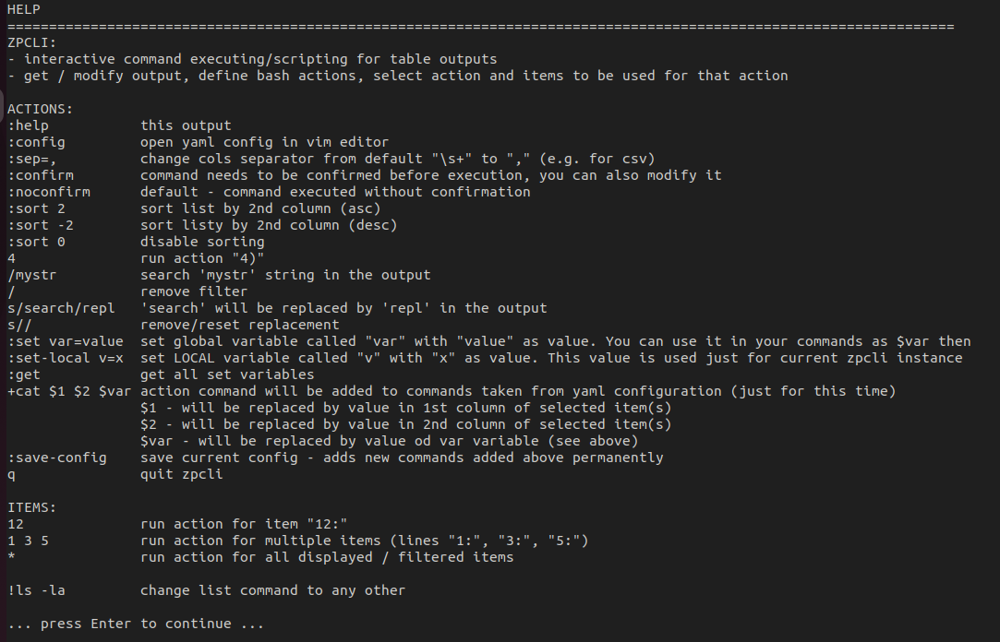

# zpcli
Linux command line tool for output filtering and interactive commands execution.

No commands typing, not copy-pasting params not searching in bash history all t he time. No grep. Transfer your params to pre-defined commands organized in groups, filter your output. Choose everythig like numbers. Simple and efective. You can spend your mental strength to your work not to searching commands and copy-pasting. Use zpcli - interactive command line interface.

### Installation:

```
git clone git@github.com:zbona/zpcli.git
cd zpcli/zpcli
./install.bash
```
### Usage:
```
zpcli "ls -la"
zpcli "docker ps -a"
zpcli "find ."
zpcli "ps aux"
zpcli "cat /path/to/myservers.txt"
zpcli "cat /path/to/my.csv"
etc
```

### Examples:



